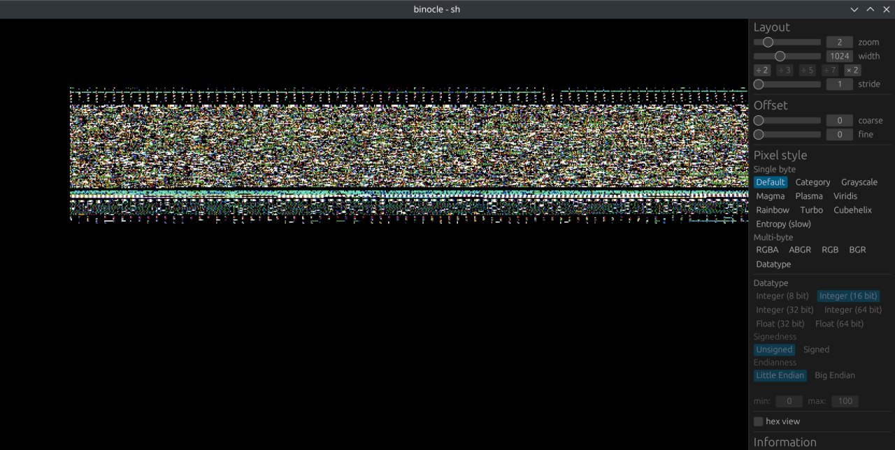
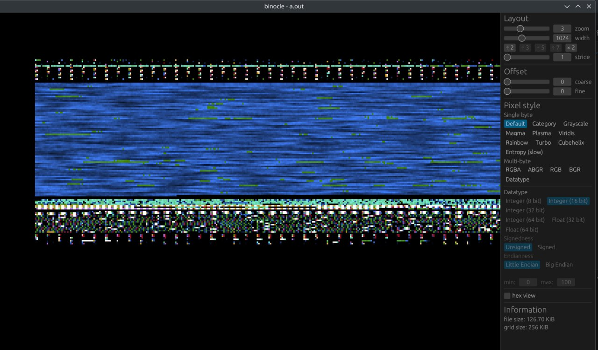

# blurelf
blurelf applies gaussian blur to selected section (default is .text) of the given ELF file

example:

```sh
$ cat > helloworld.c <<EOF
#include <stdio.h>
int main() {
	printf("hello world\n");
}
EOF

$ cc -o helloworld helloworld.c
$ blurelf -o helloworld.blur helloworld
$ ./helloworld.blur
Illegal instruction (core dumped)
```

## lil' visualization of blurelf effect on binaries

before: 


after:

